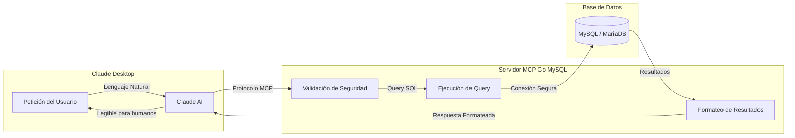

## ¿Qué es MCP Go MySQL?

MCP Go MySQL es un servidor **Model Context Protocol (MCP)** desarrollado en Go que permite a Claude Desktop interactuar de forma segura con bases de datos MySQL y MariaDB.

Proporciona 10 herramientas especializadas para realizar operaciones de lectura, escritura, análisis y gestión de base de datos, todo con seguridad de nivel empresarial integrada.

:::tip[100% Compatible con MariaDB]
MCP Go MySQL es completamente compatible tanto con **MySQL 8.0+** como con **MariaDB 11.8 LTS**. El servidor detecta automáticamente el tipo de base de datos y adapta su comportamiento para una compatibilidad óptima.
:::

## ¿Cómo Funciona?

El MCP (Model Context Protocol) permite que Claude Desktop se comunique con herramientas externas. Así es como funciona el flujo:

### Explicación del Flujo

1. **El usuario pregunta en lenguaje natural**: "Muéstrame los últimos 10 pedidos"
2. **Claude interpreta** la petición y selecciona la herramienta apropiada (`query`)
3. **El servidor MCP valida** la query contra SQL injection y patrones peligrosos
4. **La query se ejecuta** contra MySQL/MariaDB con protección de timeout
5. **Los resultados se formatean** y se devuelven a Claude
6. **Claude presenta** los datos en un formato legible

## Características Principales

| Característica | Descripción |
|----------------|-------------|
| **10 Herramientas de BD** | Set completo para consultas, escrituras, análisis y gestión |
| **Seguridad Empresarial** | Protección contra SQL injection con 23+ patrones bloqueados |
| **Rate Limiting** | Algoritmo token bucket soportando 10,000+ ops/segundo |
| **Audit Logging** | Logs detallados de operaciones para auditoría de seguridad |
| **Gestión de Timeouts** | Previene queries fugitivas con timeouts configurables |
| **Sanitización de Errores** | Protege información sensible en mensajes de error |

## Compatibilidad de Bases de Datos

| Base de Datos | Versión | Estado |
|---------------|---------|--------|
| **MySQL** | 8.0+ | ✅ Totalmente Soportado |
| **MariaDB** | 11.8 LTS | ✅ Totalmente Soportado |
| **MariaDB** | 10.x | ✅ Compatible |

:::note
El servidor usa el driver `mysql` que es compatible con MySQL y MariaDB. Los parámetros de conexión son idénticos para ambas bases de datos.
:::

## Casos de Uso

### Análisis de Datos

Consulta y analiza datos con Claude de forma interactiva usando lenguaje natural. Haz preguntas como "Muéstrame los 10 clientes con más ingresos" y obtén resultados al instante.

### Gestión de Base de Datos

Administra tablas, índices y vistas con asistencia de IA. Explora la estructura de tu base de datos, verifica índices y comprende las relaciones entre tablas.

### Optimización de Consultas

Analiza planes de ejecución y optimiza consultas SQL. Usa la herramienta `explain` para entender cómo MySQL/MariaDB procesa tus queries e identificar cuellos de botella.

### Reporting

Genera reportes y estadísticas de forma rápida y segura. Cuenta registros, muestra datos de ejemplo y ejecuta consultas complejas mediante lenguaje natural.

## Estado del Proyecto

| Aspecto | Estado |
|---------|--------|
| Versión | **v2.0.3** |
| Tests | **170/170 (100%)** |
| Vulnerabilidades | **0 detectadas** |
| Versión Go | **1.24.12** |
| Estado | **Production Ready** |

## Siguientes Pasos

- [Guía de Configuración](/es/getting-started/configuration/) - Configura MCP Go MySQL en Claude Desktop
- [Herramientas Disponibles](/es/tools/overview/) - Explora las 10 herramientas de base de datos
- [Seguridad](/es/security/overview/) - Aprende sobre las 6 capas de protección
