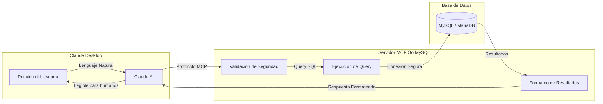

## ¿Qué es MCP Go MySQL?

MCP Go MySQL es un servidor **Model Context Protocol (MCP)** escrito en Go que da a Claude Desktop acceso estructurado a bases de datos MySQL y MariaDB.

Expone 10 herramientas que cubren consultas de lectura, escrituras, inspección del esquema, análisis de planes de ejecución e información del servidor, con validación de entrada y logs estructurados.

:::note[Compatibilidad MariaDB]
MCP Go MySQL soporta tanto **MySQL 8.0+** como **MariaDB 11.8 LTS**. El servidor detecta el tipo de base de datos al conectar y ajusta su comportamiento.
:::

## ¿Cómo funciona?

El MCP (Model Context Protocol) permite a Claude Desktop comunicarse con herramientas externas. El flujo es así:

### Explicación del flujo

1. **El usuario pregunta en lenguaje natural**: "Muéstrame los últimos 10 pedidos"
2. **Claude interpreta** la petición y selecciona la herramienta apropiada (`query`)
3. **El servidor MCP valida** la sentencia: el verbo inicial está en la lista blanca, no hay sentencias apiladas, no hay cláusula `INTO OUTFILE`
4. **La consulta se ejecuta** contra MySQL/MariaDB con protección de timeout
5. **Los resultados se formatean** y se devuelven a Claude
6. **Claude presenta** los datos en un formato legible

## Glosario

¿Nuevo en estos términos? Referencia rápida:

| Término | Descripción |
|---------|-------------|
| **MCP** | Model Context Protocol — estándar que permite a asistentes de IA como Claude interactuar con herramientas y servicios externos. |
| **JSON-RPC** | Protocolo de llamadas a procedimientos remotos en JSON, usado entre cliente y servidor. |
| **stdio** | Entrada/salida estándar — el método de comunicación entre Claude Desktop y el servidor MCP. |
| **Clasificador de verbos** | La capa de validación que solo deja pasar ciertos verbos SQL iniciales (`SELECT`, `INSERT`, etc.) y rechaza el resto, incluida la gestión de privilegios y el acceso al sistema de archivos. |
| **Umbral por filas** | Tras ejecutar una escritura, el MCP comprueba cuántas filas se vieron afectadas. Si supera `MAX_SAFE_ROWS` (por defecto 100), la operación se revierte salvo que se haya pasado `confirm_key`. |

## Características principales

| Característica | Descripción |
|----------------|-------------|
| **10 herramientas** | Consultas de lectura, escrituras, inspección del esquema, planes de ejecución, info del servidor |
| **Clasificador de verbos** | Lista blanca de verbos SQL; gestión de privilegios y acceso al sistema de archivos siempre rechazados |
| **Umbral por filas** | Las escrituras que afectan a más de `MAX_SAFE_ROWS` filas requieren `confirm_key` |
| **Detección de sentencias apiladas** | `SELECT 1; DROP DATABASE foo` — rechazado |
| **Gestión de timeouts** | Timeouts configurables por tipo de operación |
| **Logs estructurados** | Logs de todas las operaciones con tiempos y filas afectadas |

## Compatibilidad de bases de datos

| Base de Datos | Versión | Estado |
|---------------|---------|--------|
| **MySQL** | 8.0+ | ✅ Soporte completo |
| **MariaDB** | 11.8 LTS | ✅ Soporte completo |
| **MariaDB** | 10.x | ✅ Compatible |

:::note
El servidor usa el driver `mysql`, compatible con ambos. Los parámetros de conexión son idénticos.
:::

## Casos de uso

### Análisis de datos

Consulta y explora el contenido de la base de datos usando lenguaje natural. El servidor traduce intenciones a SQL y devuelve resultados estructurados.

### Gestión del esquema

Inspecciona tablas, índices y vistas. Entiende la estructura del esquema y las definiciones de columnas sin escribir SQL a mano.

### Optimización de consultas

Usa la herramienta `explain` para examinar cómo MySQL o MariaDB procesa una consulta, incluyendo uso de índices, tipo de join y filas estimadas.

### Reporting

Ejecuta agregaciones, conteos y consultas filtradas. Muestrea tablas para entender la forma de los datos antes de escribir sentencias más complejas.

## Estado del proyecto

| Aspecto | Estado |
|---------|--------|
| Versión | **v3.0.0** |
| Vulnerabilidades conocidas | **0** |
| Go | **1.26.2** |
| Licencia | MIT |

## Siguientes pasos

- [Guía de configuración](/es/getting-started/configuration/) — Configura MCP Go MySQL en Claude Desktop
- [Herramientas disponibles](/es/tools/overview/) — Referencia de las 10 herramientas
- [Seguridad](/es/security/overview/) — El modelo de seguridad de dos capas
