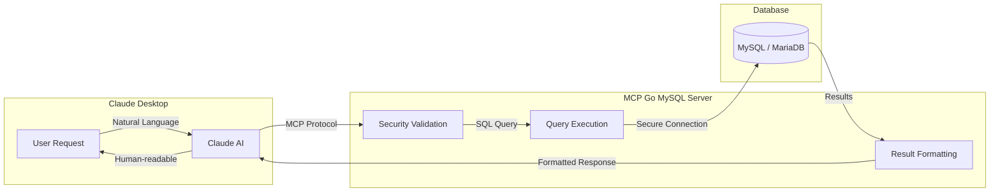

## What is MCP Go MySQL?

MCP Go MySQL is a **Model Context Protocol (MCP)** server written in Go that gives Claude Desktop structured access to MySQL and MariaDB databases.

It exposes 10 tools covering read queries, writes, schema inspection, execution plan analysis, and server information, with input validation and structured logging.

::: note[MariaDB Compatibility]
MCP Go MySQL supports both **MySQL 8.0+** and **MariaDB 11.8 LTS**. The server detects the database type at connection time and adjusts its behavior accordingly.
:::

## How Does It Work?

The MCP (Model Context Protocol) enables Claude Desktop to communicate with external tools. Here's how the flow works:

### Flow Explanation

1. **User asks in natural language**: "Show me the last 10 orders"
2. **Claude interprets** the request and selects the appropriate tool (`query`)
3. **MCP Server validates** the statement: leading verb is on the whitelist, no stacked statements, no `INTO OUTFILE` clause
4. **Query executes** against MySQL/MariaDB with timeout protection
5. **Results are formatted** and returned to Claude
6. **Claude presents** the data in a readable format

## Glossary

New to these terms? Here's a quick reference:

| Term | Description |
|------|-------------|
| **MCP** | Model Context Protocol — A standard that lets AI assistants like Claude interact with external tools and services. |
| **JSON-RPC** | A remote procedure call protocol using JSON for communication between client and server. |
| **stdio** | Standard input/output — the communication method between Claude Desktop and the MCP server. |
| **Verb classifier** | The validation layer that allows only certain leading SQL verbs (`SELECT`, `INSERT`, etc.) and rejects everything else, including privilege management and filesystem access. |
| **Row-count gate** | After a write executes, the MCP checks how many rows were affected. Above `MAX_SAFE_ROWS` (default 100), the operation is rolled back unless `confirm_key` was supplied. |

## Key Features

| Feature | Description |
|---------|-------------|
| **10 Database Tools** | Read queries, writes, schema inspection, execution plans, server info |
| **Verb classifier** | Whitelist of allowed SQL verbs; privilege management and filesystem access always rejected |
| **Row-count gate** | Writes affecting more than `MAX_SAFE_ROWS` rows require `confirm_key` |
| **Stacked-statement detection** | `SELECT 1; DROP DATABASE foo` — rejected |
| **Timeout management** | Configurable per-operation timeouts |
| **Structured logs** | Logs of all operations with timing and row counts |

## Database Compatibility

| Database | Version | Status |
|----------|---------|--------|
| **MySQL** | 8.0+ | ✅ Fully Supported |
| **MariaDB** | 11.8 LTS | ✅ Fully Supported |
| **MariaDB** | 10.x | ✅ Compatible |

:::note
The server uses `mysql` driver which is compatible with both MySQL and MariaDB. Connection parameters are identical for both databases.
:::

## Use Cases

### Data Analysis

Query and explore database content through natural language requests to Claude. The server translates intents into SQL and returns structured results.

### Database Management

Inspect tables, indexes, and views. Understand schema structure and column definitions without writing SQL manually.

### Query Optimization

Use the `explain` tool to examine how MySQL or MariaDB processes a query, including index usage, join type, and estimated row counts.

### Reporting

Run aggregations, counts, and filtered queries. Sample tables to understand data shape before writing more complex statements.

## Project Status

| Aspect | Status |
|--------|--------|
| Version | **v3.0.0** |
| Known vulnerabilities | **0** |
| Go version | **1.26.2** |
| License | MIT |

## Next Steps

- [Configuration Guide](/getting-started/configuration/) — Set up MCP Go MySQL in Claude Desktop
- [Available Tools](/tools/overview/) — Reference for all 10 database tools
- [Security](/security/overview/) — The two-layer security model
