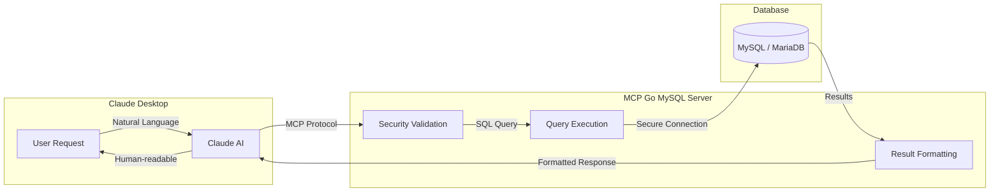

## What is MCP Go MySQL?

MCP Go MySQL is a **Model Context Protocol (MCP)** server written in Go that gives Claude Desktop structured access to MySQL and MariaDB databases.

It exposes 10 tools covering read queries, writes, schema inspection, execution plan analysis, and server information, with input validation and audit logging built in.

::: note[MariaDB Compatibility]
MCP Go MySQL supports both **MySQL 8.0+** and **MariaDB 11.8 LTS**. The server detects the database type at connection time and adjusts its behavior accordingly.
:::

## How Does It Work?

The MCP (Model Context Protocol) enables Claude Desktop to communicate with external tools. Here's how the flow works:

### Flow Explanation

1. **User asks in natural language**: "Show me the last 10 orders"
2. **Claude interprets** the request and selects the appropriate tool (`query`)
3. **MCP Server validates** the query for SQL injection and dangerous patterns
4. **Query executes** against MySQL/MariaDB with timeout protection
5. **Results are formatted** and returned to Claude
6. **Claude presents** the data in a readable format

## Glossary

New to these terms? Here's a quick reference:

| Term | Description |
|------|-------------|
| **MCP** | Model Context Protocol - A standard that allows AI assistants like Claude to interact with external tools and services |
| **JSON-RPC** | A remote procedure call protocol using JSON format for communication between client and server |
| **stdio** | Standard input/output - The communication method used between Claude Desktop and the MCP server |
| **Token bucket** | A rate limiting algorithm that allows short bursts of activity while maintaining an average rate limit |
| **SQL injection** | A security attack where malicious SQL code is inserted into queries - MCP Go MySQL blocks 23+ injection patterns |

## Key Features

| Feature | Description |
|---------|-------------|
| **10 Database Tools** | Read queries, writes, schema inspection, execution plans, server info |
| **Input Validation** | SQL injection filtering with 23+ patterns |
| **Rate Limiting** | Token bucket with per-operation-type limits |
| **Audit Logging** | Structured logs of all operations with timing and row counts |
| **Timeout Management** | Configurable timeouts per operation type |
| **Error Sanitization** | Strips credentials, paths, and host details from error output |

## Database Compatibility

| Database | Version | Status |
|----------|---------|--------|
| **MySQL** | 8.0+ | ✅ Fully Supported |
| **MariaDB** | 11.8 LTS | ✅ Fully Supported |
| **MariaDB** | 10.x | ✅ Compatible |

:::note
The server uses `mysql` driver which is compatible with both MySQL and MariaDB. Connection parameters are identical for both databases.
:::

## Use Cases

### Data Analysis

Query and explore database content through natural language requests to Claude. The server translates intents into SQL and returns structured results.

### Database Management

Inspect tables, indexes, and views. Understand schema structure and column definitions without writing SQL manually.

### Query Optimization

Use the `explain` tool to examine how MySQL or MariaDB processes a query, including index usage, join type, and estimated row counts.

### Reporting

Run aggregations, counts, and filtered queries. Sample tables to understand data shape before writing more complex statements.

## Project Status

| Aspect | Status |
|--------|--------|
| Version | **v2.0.3** |
| Tests | **170 / 170** |
| Known vulnerabilities | **0** |
| Go version | **1.24.12** |
| License | MIT |

## Next Steps

- [Configuration Guide](/getting-started/configuration/) - Set up MCP Go MySQL in Claude Desktop
- [Available Tools](/tools/overview/) - Explore all 10 database tools
- [Security](/security/overview/) - Learn about the 6 layers of protection
