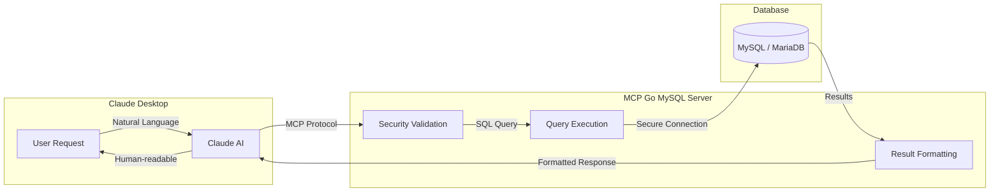

## What is MCP Go MySQL?

MCP Go MySQL is a **Model Context Protocol (MCP)** server developed in Go that allows Claude Desktop to securely interact with MySQL and MariaDB databases.

It provides 10 specialized tools to perform read, write, analysis, and database management operations, all with integrated enterprise-grade security.

:::tip[100% MariaDB Compatible]
MCP Go MySQL is fully compatible with both **MySQL 8.0+** and **MariaDB 11.8 LTS**. The server automatically detects the database type and adapts its behavior for optimal compatibility.
:::

## How Does It Work?

The MCP (Model Context Protocol) enables Claude Desktop to communicate with external tools. Here's how the flow works:

### Flow Explanation

1. **User asks in natural language**: "Show me the last 10 orders"
2. **Claude interprets** the request and selects the appropriate tool (`query`)
3. **MCP Server validates** the query for SQL injection and dangerous patterns
4. **Query executes** against MySQL/MariaDB with timeout protection
5. **Results are formatted** and returned to Claude
6. **Claude presents** the data in a readable format

## Key Features

| Feature | Description |
|---------|-------------|
| **10 Database Tools** | Complete set for queries, writes, analysis, and management |
| **Enterprise Security** | SQL injection protection with 23+ patterns blocked |
| **Rate Limiting** | Token bucket algorithm supporting 10,000+ ops/second |
| **Audit Logging** | Detailed operation logs for security auditing |
| **Timeout Management** | Prevents runaway queries with configurable timeouts |
| **Error Sanitization** | Protects sensitive information in error messages |

## Database Compatibility

| Database | Version | Status |
|----------|---------|--------|
| **MySQL** | 8.0+ | ✅ Fully Supported |
| **MariaDB** | 11.8 LTS | ✅ Fully Supported |
| **MariaDB** | 10.x | ✅ Compatible |

:::note
The server uses `mysql` driver which is compatible with both MySQL and MariaDB. Connection parameters are identical for both databases.
:::

## Use Cases

### Data Analysis

Query and analyze data with Claude interactively using natural language. Ask questions like "Show me the top 10 customers by revenue" and get results instantly.

### Database Management

Manage tables, indexes, and views with AI assistance. Explore your database structure, check indexes, and understand relationships between tables.

### Query Optimization

Analyze execution plans and optimize SQL queries. Use the `explain` tool to understand how MySQL/MariaDB processes your queries and identify performance bottlenecks.

### Reporting

Generate reports and statistics quickly and securely. Count records, sample data, and run complex queries through natural language.

## Project Status

| Aspect | Status |
|--------|--------|
| Version | **v2.0.1** |
| Tests | **170/170 (100%)** |
| Vulnerabilities | **0 detected** |
| Go Version | **1.24.12** |
| Status | **Production Ready** |

## Next Steps

- [Configuration Guide](/getting-started/configuration/) - Set up MCP Go MySQL in Claude Desktop
- [Available Tools](/tools/overview/) - Explore all 10 database tools
- [Security](/security/overview/) - Learn about the 6 layers of protection
